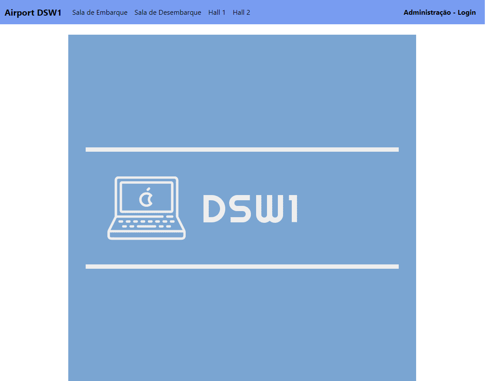
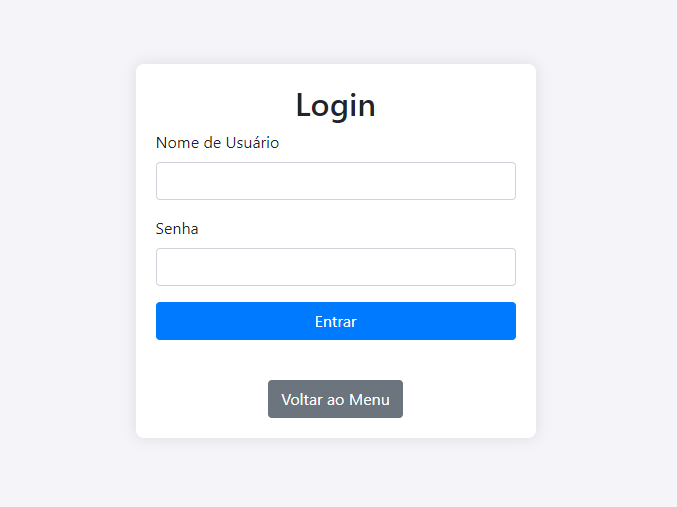
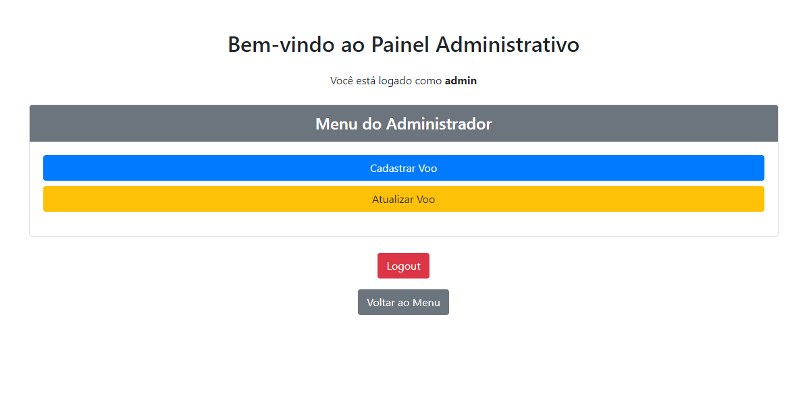
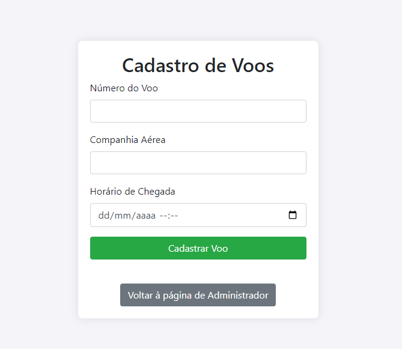
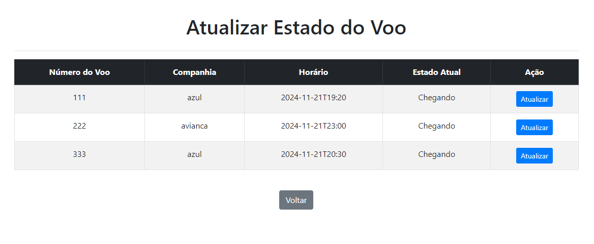
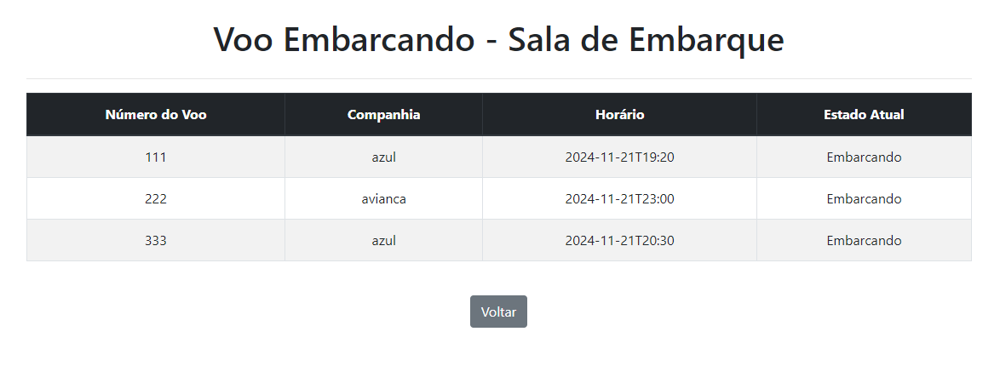
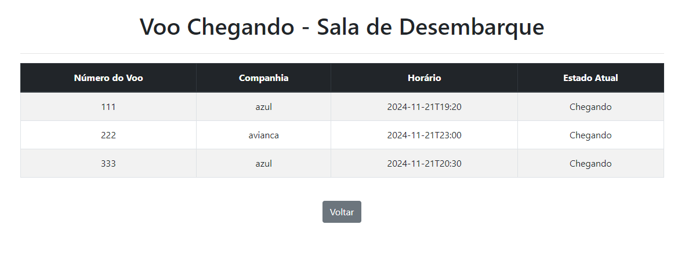
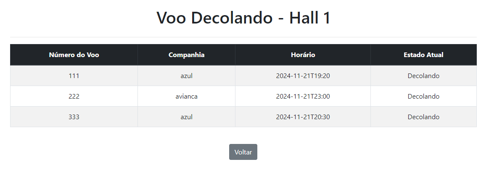
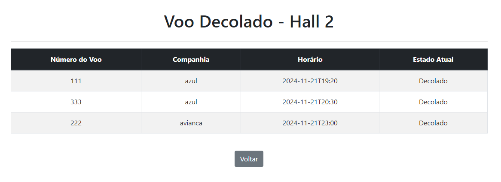

# Projeto Aeroporto

## Descrição do projeto

### Autor:

O projeto do Aeroporto (gerenciador de Voos) foi criado por Gabriel de Pauli Santos, aluno do curso de Análise e Desenvolvimento de Sistemas no IFSP - Campus Araraquara.

### Tecnologias utilizadas:

- **JSP:** Utilizado na criação das páginas usadas no projeto.
- **HTML:** Utilizado na criação da JSP "index".
- **Java:** Principal linguagem de programação utilizada, necessária para a criação de toda a lógica das funções do programa.
- **Servlet:** Utilizado nos FrontControllers. **Está sendo utilizado o Java 21 no Eclipse**
- **Bootstrap:** Utilizado para estilizar as página JSP.
- **CSS:** Utilizado para fazer a estilização das páginas utilizadas.
- **Padrões de Projeto:** Foram utilizados os padrões FrontControler, MVC, State, Observer e Singleton.

## Sobre o projeto

Este projeto é uma aplicação Web (desenvolvida no Eclipse) que tem o objetivo de simular um gereciamento do aeroporto, onde se pode gerenciar os Voos (criar Voos, alterar estado, etc...)

Para que o sistema funcione corretamente foram adicionadas algumas funções:

- **Página Index:** Esta página possui uma imagem de fundo e uma navbar com os links para as páginas que podem ser acessadas.

- **Login:** O sistema possui uma página de login onde somente o Administrador pode ter acesso, as credenciais de acesso são o usuário "admin" e a senha "admin".

- **Página do administrador:** Após ser efetuado o Login, o administrador terá acesso a uma página de aministração com dois botões para as funcionalidades de "Cadastrar um Voo" e de "Atualizar um Voo". Além dos botões de Logout e voltar a página inicial.

- **Cadastro de voos:** Clicando no botão de cadastrar voo, o administrador poderá incluir um Voo, no qual deve possuir um número (único), o nome da companhia aérea e o dia e horário do voo. Apenas o administrador tem acesso a essa função.

- **Atualizar estado de voo:** Clicando no botão de atualizar voo, o administrador poderá fazer a atualização do estado do Voo. Vale ressaltar que todo voo quando é criado começa no estado "Arriving" (ou "Chegando") e vai mudando de estado da seguinte forma "chegando → embarcando → decolando → decolado", quando chegar no "TookOff" (ou "Decolado") ele é retirado da lista de Voos. Apenas o administrador tem acesso a essa função, podendo visualizar uma tabela com a lista de Voos e a opção de alterar o estado individual de cada um.

- **Logout:** Na página da administração, assim que o administrador estiver logado no sistema, ele poderá clicar no botão de logout que irá encerrar sua sessão e o redirecionar para página inicial.

- **Páginas dos totens:** No menu inicial ("index") estão os links para cada Totem, nessas páginas (Totem) poderão ser visualizados os Voos de cada estado (chegando, embarcando, decolando e decolado).

## Fotos do site em funcionamento

### Página Inicial

Nesta página é onde teremos acessos aos links para fazer o login do Administrador e para acesso aos Totens, que possuem as tabelas de voo com seu estado.

### Login Administrador

A Página de Login do administrador é o local onde deve ser inserido o username "admin" e senha "admin" para se ter acesso a página do administrador e suas funcionalidades. Se o login e senha estiverem errados será exibida uma mensagem de erro na tela.

### Página do Administrador

A Página do Administrador é a página onde serão mostrados os botões para as funcionalidades de "Adicionar Voo", "Alterar Voo", "Logout", "Voltar para página inicial".

### Cadastro de Voos

A Página de cadastro de voos é onde o administrador poderá incluir novos voos, inserindo o número, o nome da empresa aérea e a data e hora do voo.

### Atualizar Estado do Voo

A Página de atualizar estado do voo é onde será possível modificar o estado do voo. Aqui será mostrada uma tabela com todos os voos do sistema e a opção individual de alterar o estado.

### Totem Sala de Embarque

Nesta página do Totem de Embarque será exibida uma tabela com todos os voos no estado "embarque" (ou "boarding").

### Totem Sala de Desembarque

Nesta página do Totem de Desembarque será exibida uma tabela com todos os voos no estado "chegando" (ou "Arriving").

### Totem Hall 1

Nesta página do Totem do Hall 1 será exibida uma tabela com todos os voos no estado "decolando" (ou "Taking Off").

### Totem Hall 2

Nesta página do Totem do Hall 2 será exibida uma tabela com todos os voos no estado "decolado" (ou "Took Off").

